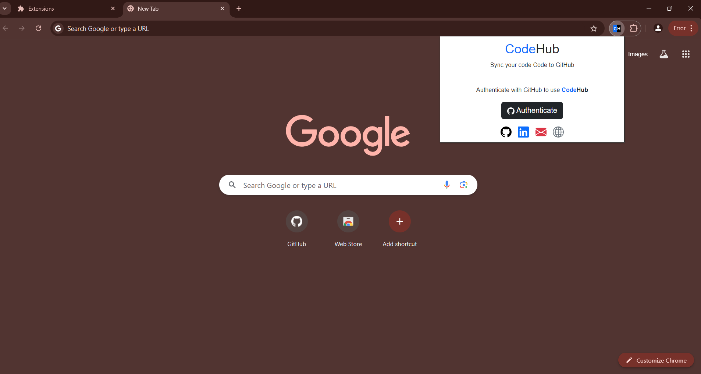
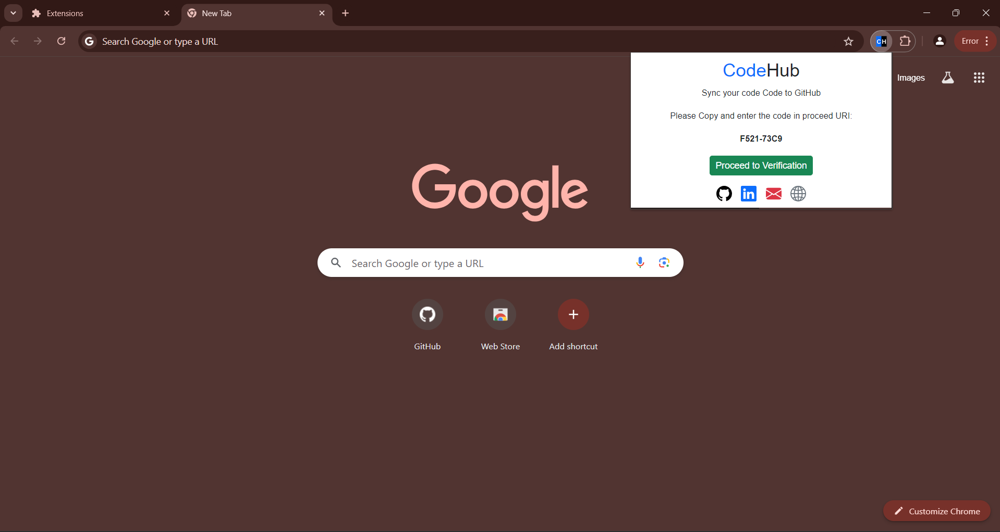
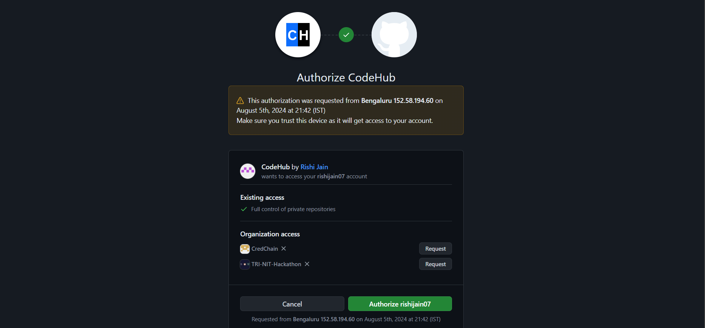
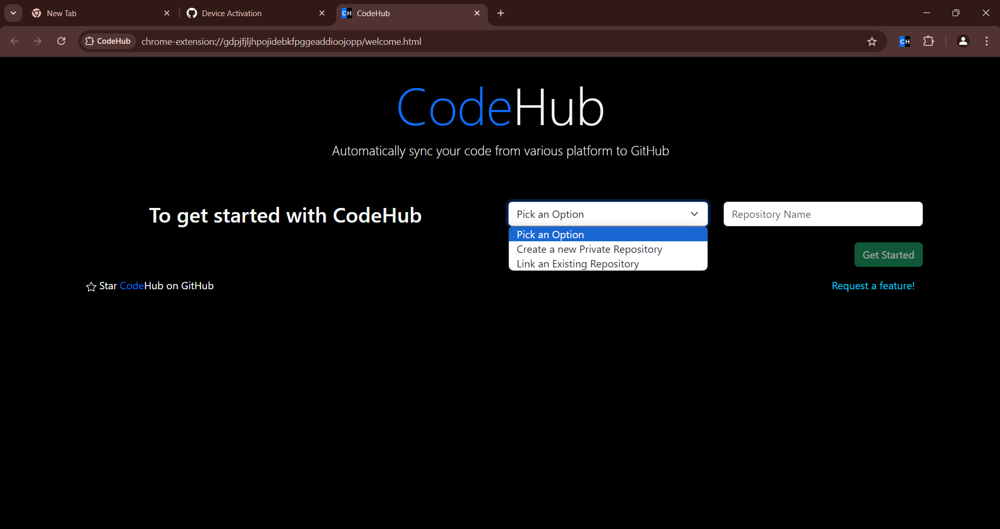
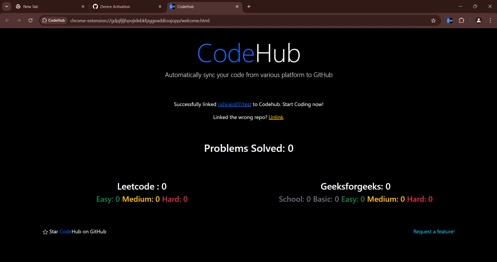
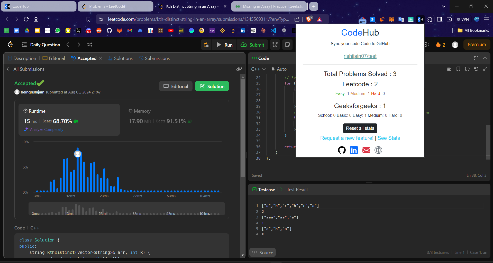

<h1 align="center">
  
    <a href="https://github.com/rishijain07/CodeHub/">CodeHub</a> 
</h1>
<h3 align="center">Automatically sync your Leetcode and GeeksForGeeks submission to GitHub.</h3>

  

## What is CodeHub?

A extension that automatically pushes your code to GitHub when you pass all tests on a [Leetcode](https://leetcode.com/) problem and [GeeksForGeeks](https://geeksforgeeks.org/explore). It's forked from the original [LeetHub V2](https://chromewebstore.google.com/detail/leethub-v2/mhanfgfagplhgemhjfeolkkdidbakocm) and improves on it to be faster, cleaner, and compatible with the old and new dynamic LeetCode UI and GeeksForGeeks UI.

## Why CodeHub?

1. There's no easy way of accessing your Leetcode  and GeeksForGeeks problem's solution in one place!  
Moreover, pushing code manually to GitHub from these platform is very time-consuming. So, why not just automate it entirely without spending a SINGLE additional second on it?

2. CodeHub just makes it much easier (autonomous) to keep track of progress of problem solving across the leetcode and geekforgeeks platform

3. **Recruiters** *want* to see your progress and solving algorithms/data-structures. As of now, GitHub is developers' #1 portfolio. CodeHub just makes it much easier to show progress and problems solved.

## How does CodeHub work?

It's as simple as:

1. After installation, launch CodeHub.
2. Click on the "Authenticate with GitHub" button to automatically set up your account with CodeHub.
3. Copy the displayed code and enter that on proceeded URI
4. Set up an existing/new repository with CodeHub (private by default) by clicking the "Get Started" button.
5. Begin Coding! To view your progress, simply click on the extension!

**BONUS:** Star [this repository](https://github.com/rishijain07/CodeHub) for further development of features. If you want a particular feature, simply [request](https://github.com/rishijain07/CodeHub/labels/enhancement) for it!

Let's see you ACE that coding interview!

## Snippets of Extension

    
    

    
    

    
    

## How to set up CodeHub for local development?

1. Fork this repo and clone it to your local machine.
2. Run `npm run setup` to install the developer dependencies.
3. Run `npm run build` to build the final extension files into the `./dist/` directory.
4. Go to [chrome://extensions](chrome://extensions) or [about:debugging](https://firefox-source-docs.mozilla.org/devtools-user/about_colon_debugging/index.html#extensions) in Firefox.
   - In Chrome, enable [Developer mode](https://support.google.com/chrome/a/answer/2714278) by toggling the switch in the top right corner.
5. Click `Load unpacked` or `Load Temporary Add-on...`.
6. Select the `./dist/chrome` or `./dist/firefox` LeetHub folder.
7. That's it! Be sure to `npm run build` and reload the extension after making changes.
